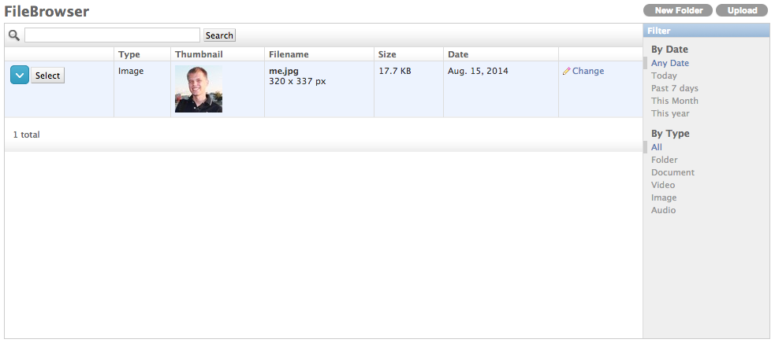

Django FileBrowser
==================

**Media-Management**. (based on https://github.com/sehmaschine/django-filebrowser)

The FileBrowser is an extension to the `Django <http://www.djangoproject.com>`_ administration interface in order to:

* browse directories on your server and upload/delete/edit/rename files.
* include images/documents to your models/database using the ``FileBrowseField``.
* select images/documents with TinyMCE.

Requirements
------------

FileBrowser 3.5 requires

* Django 1.4 or 1.5 or 1.6 (http://www.djangoproject.com)
* Pillow (https://github.com/python-imaging/Pillow)

No Grappelli
-----------

This fork removes the dependency on Grappelli.

Installation
------------

    pip install -e git+git://github.com/smacker/django-filebrowser-no-grappelli.git#egg=django-filebrowser

Documentation
-------------

http://readthedocs.org/docs/django-filebrowser/

It also has fake model to show filebrowser in admin dashboard, but you can disable it by setting ``FILEBROWSER_SHOW_IN_DASHBOARD = False``.

Translation
-----------

https://www.transifex.com/projects/p/django-filebrowser/

Releases
--------

* FileBrowser 3.5.7 (Development Version, not yet released, see Branch Stable/3.5.x)
* FileBrowser 3.5.6 (April 16th, 2014): Compatible with Django 1.4/1.5/1.6

Older versions are availabe at GitHub, but are not supported anymore.
